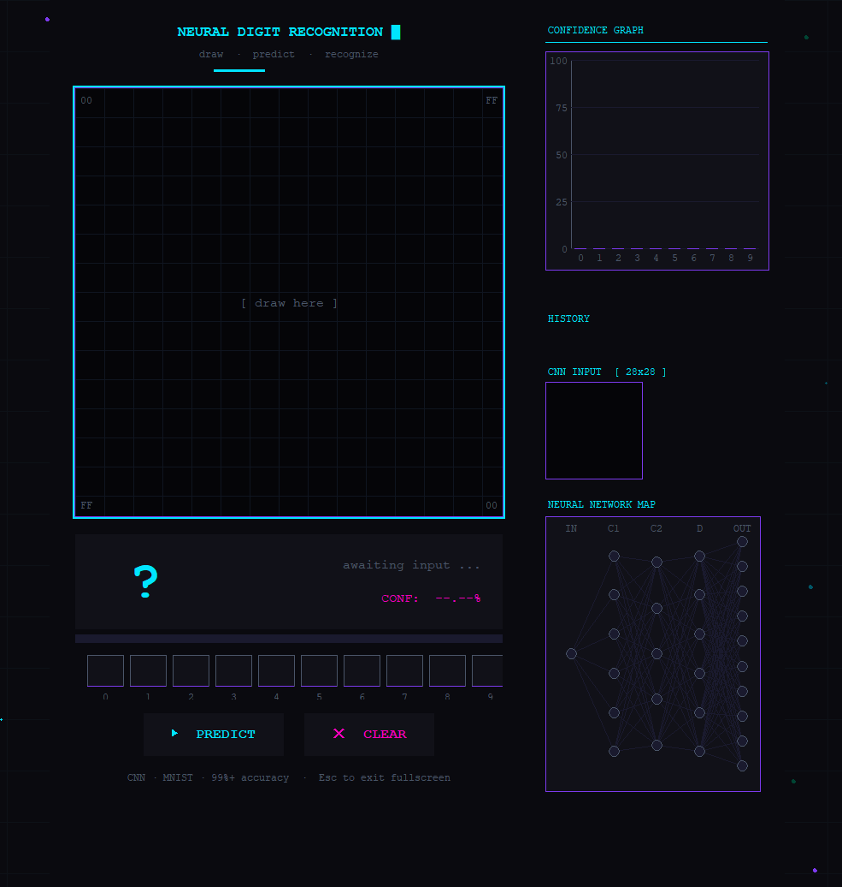
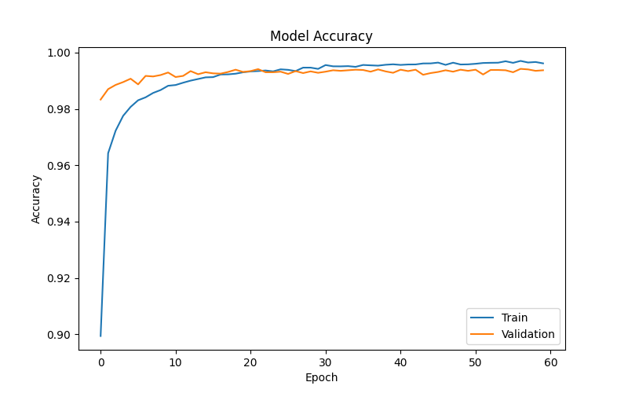
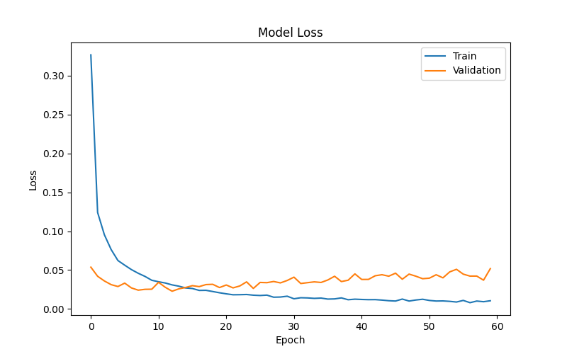
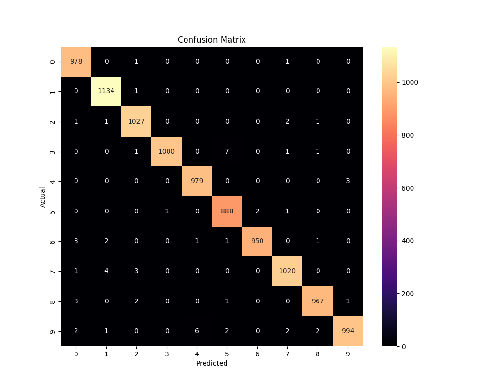

README.md
# Neural Vision Interface

An interactive handwritten digit recognition system featuring realtime neural activity visualization, confidence analytics, animated neuron mapping, and a futuristic cyberpunk-inspired UI.

---


## Features

- Realtime handwritten digit recognition
- Interactive drawing canvas
- Live confidence graph
- Animated neural network visualization
- Pulsing neuron activity simulation
- Signal flow animation between layers
- Top prediction tracking
- Prediction history
- 28×28 preprocessing preview
- Realtime preprocessing pipeline
- Cyberpunk-inspired futuristic interface
- Fullscreen immersive UI

---

## Tech Stack

- Python
- TensorFlow / Keras
- OpenCV
- Tkinter
- NumPy
- Pillow (PIL)

---

## Project Structure

```text
Neural-Vision-Interface/
│
├── model/
│   └── digit_model.keras
│
├── screenshots/
│   ├── main_ui.png
│   ├── neural_map.png
│   └── prediction_demo.png
│
├── app.py
├── requirements.txt
├── README.md
├── LICENSE
└── .gitignore
Neural Visualization System

The application includes a custom neural activity visualizer that simulates:

neuron activation
signal propagation
active pathway highlighting
output layer confidence response

The visualization updates in realtime during prediction.

screenshots:
GUI


Accuracy Graph


Loss Graph


Confusion Matrix


Sample Predictions


Run Project

Install dependencies:

pip install -r requirements.txt

Run GUI:

python app.py

Train model:

python train.py

Future Improvements:
Multi-digit OCR
EMNIST support
Live webcam recognition
Grad-CAM visualization
Flask web deployment
Real-time inference benchmarking

Inspiration
Inspired by futuristic AI interfaces and neural visualization systems.

Author: Debarghya

License: MIT License